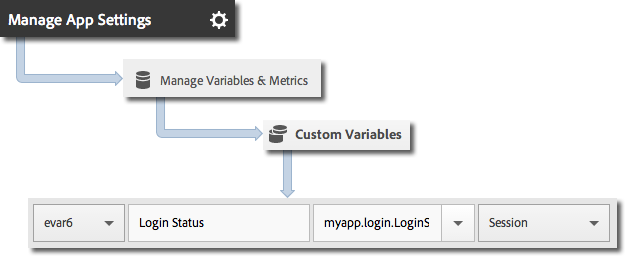
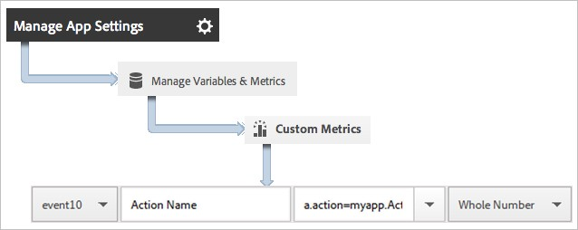
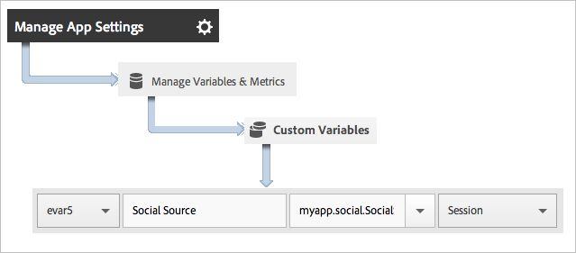
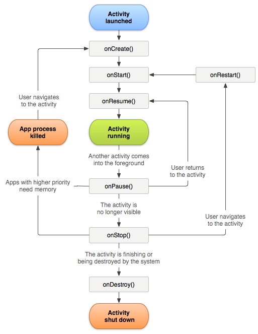
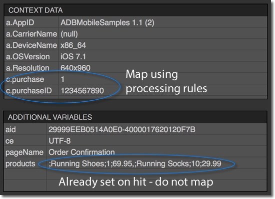
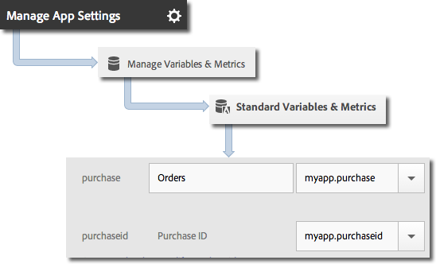
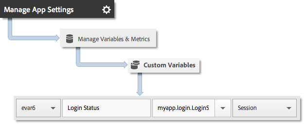
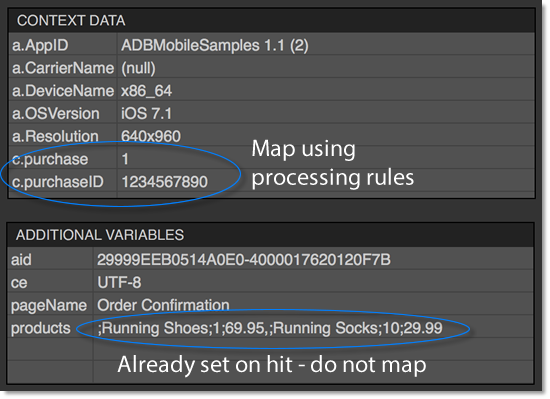
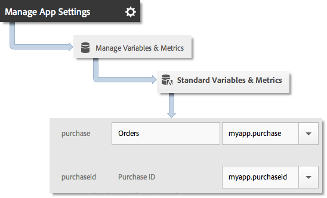

[Analytics 2](#analytics)

[Track App States in Android 2](#track-app-states-in-android)

[Track App Actions in Android 3](#track-app-actions-in-android)

[Track States and Actions in Android
5](#track-states-and-actions-in-android)

[Track App Crashes in Android 5](#track-app-crashes-in-android)

[Hit Batching in Android 8](#hit-batching-in-android)

[Products Variable 8](#products-variable)

[Products Variable with Merchandising eVars and Product-Specific Events
10](#products-variable-with-merchandising-evars-and-product-specific-events)

[Event Serialization 10](#event-serialization)

[Video Analytics 11](#video-analytics)

[Analytics Methods in Android 11](#analytics-methods-in-android)

[Track App States in iOS 13](#track-app-states-in-ios)

[Track App Actions in iOS 14](#track-app-actions-in-ios)

[Track States and Actions in iOS 16](#track-states-and-actions-in-ios)

[Track App Crashes in iOS 16](#track-app-crashes-in-ios)

[Hit Batching in iOS 17](#_Toc513631201)

[Products Variable 18](#products-variable-1)

[Products Variable with Merchandising eVars and Product-Specific Events
19](#products-variable-with-merchandising-evars-and-product-specific-events-1)

[Event Serialization 20](#event-serialization-1)

[Video Analytics 21](#video-analytics-1)

[Analytics Methods in iOS 21](#analytics-methods-in-ios)

Analytics
=========

> This section helps app developers understand how the Mobile Services
> SDKs interact with Adobe Analytics.

Track App States in Android
===========================

> States are the different screens or views in your application. Each
> time a new state is displayed in your application, for example, when a
> user navigates from the home page to the news feed, a track() call is
> sent.
>
> **Important**: You can track the state or track the action, and you
> can also track the state and action at the same time.

1.  Add the library to your project.

2.  Import the library:

> import com.adobe.marketing.mobile.\*;

3.  After creating the the AalyticsRequest instance, call track method
    to send a hit for this state view:

4.  Send additional

> In addition to the state name, you can send additional context data
> with each track call:
>
> **(The following information will chnge depending on what happens with
> the Launch merge.)**
>
> Context data values must be mapped to custom variables in [*Adobe
> Mobile services*](https://mobilemarketing.adobe.com/):
>
> {width="4.3597222222222225in"
> height="1.7895833333333333in"}

#### Not sure if we should put so much detail here, maybe there should be a separate page describing how ot view the report, and here we can simply provide a link.

#### App State Reporting

> States are typically viewed by using a pathing report, which allows
> you to see how users navigate your app and which states are most
> frequently viewed.

|-----------------------------------|-----------------------------------|
| Adobe Mobile Services             | The **View States** report.       |
|                                   |                                   |
|                                   | This report is based on the paths |
|                                   | that the users took through your  |
|                                   | application. A sample path is     |
|                                   | **Home** \>                       |
|                                   |                                   |
|                                   | **Settings** \> **Feed**.         |
|-----------------------------------|-----------------------------------|
| Adobe Analytics                   | States can be viewed anywhere     |
|                                   | that **Pages** can be viewed,     |
|                                   | such as the **Pages** report, the |
|                                   | **Page Views** report, and the    |
|                                   | **Path** report.                  |
|-----------------------------------|-----------------------------------|
| Ad hoc analytics                  | States can be viewed anywhere     |
|                                   | **Pages** can be viewed by using  |
|                                   | the **Page** dimension, **Page    |
|                                   | Views** metric, **Path**          |
|                                   |                                   |
|                                   | reports.                          |
|-----------------------------------|-----------------------------------|

Track App Actions in Android
============================

> Actions are the events that occur in your Android app that you want to
> measure.
>
> The actions are events that occur in your application that you want to
> measure; the corresponding metrics will be incremented each time the
> event occurs. For example, you might want to track when a user clicks
> the **Log in** button, or when an article was viewed.
>
> **Important**: In the 5.x SDKs, state and action use the same method.
> You can track the state or track the action separately or track the
> state and action at the same time.

1.  Add the library to your project.

2.  Import the library:

    import com.adobe.marketing.mobile.AdobeMobileMarketing;

3.  When the action that you want to track occurs in your app, call
    track to send a hit for this action:

> **(The following information will change depending on what happens
> with the Launch merge, so please ignore for now.)**

4.  In the Adobe Mobile Services UI, select your app and click **Manage
    App Settings**.

5.  Click **Manage Variables and Metrics** and click the **Custom
    Metrics** tab.

6.  Map the context data name that is defined in your code, for example,
    myapp.ActionName, to a custom event.

{width="4.458333333333333in"
height="1.7777777777777777in"}

> You can also set a prop to hold all action values by mapping a custom
> prop with a name like **Custom Actions** and setting the value to
> a.action.

{width="4.458333333333333in"
height="1.7777777777777777in"}

5.  Send additional data

> In addition to the action name, you can send additional context data
> with each track action call:
>
> Context data values must be mapped to custom variables in [*Adobe
> Mobile services*](https://mobilemarketing.adobe.com/):
>
> {width="4.458333333333333in"
> height="1.9583333333333333in"}

#### Action Reporting

|-----------------------------------|-----------------------------------|
| **Interface**                     | **Report**                        |
|-----------------------------------|-----------------------------------|
| Adobe Mobile Services             | **Action Paths** report.          |
|                                   |                                   |
|                                   | View the order in which actions   |
|                                   | occur in your app. You can also   |
|                                   | click **Customize** on any report |
|                                   | to view actions ranked, trended,  |
|                                   | or in a breakdown report or apply |
|                                   | a filter to view actions for a    |
|                                   | specific segment.                 |
|-----------------------------------|-----------------------------------|
| Marketing reports & analytics     | **Custom Event** report.          |
|                                   |                                   |
|                                   | After an action is mapped to a    |
|                                   | custom event, you can view mobile |
|                                   | events similar to all other       |
|                                   | Analytics events.                 |
|-----------------------------------|-----------------------------------|
| Ad hoc analytics                  | **Custom Event** report.          |
|                                   |                                   |
|                                   | After an action is mapped to a    |
|                                   | custom event, you can view mobile |
|                                   | events similar to all other       |
|                                   | Analytics events.                 |
|-----------------------------------|-----------------------------------|

Track States and Actions in Android
===================================

> To track states and actions at the same time, type the following:

 Map\<String, String\> additionalContextData = new HashMap\<String,
String\>();

additionalContextData.put(\"customKey\", \"value\");

AdobeMobileMarketing.AnalyticsRequest analyticsRequest = new
AdobeMobileMarketing.AnalyticsRequest.Builder(\"loginClicked\",
\"mainPage\").withContextData(additionalContextData).build();

analyticsRequest.track();

> **Important:** please note that tracking an action and a state in the
> same time will not increment the page views for the given state name.
> If you want to increment the page views number, you should track only
> the state name, setting the action name on null.

Track App Crashes in Android
============================

> This information helps you understand how crashes are tracked and the
> best practices to handle false crashes. (Link to Lifecycle content)
>
> {width="0.14027777777777778in"
> height="0.22777777777777777in"} ***Prerequisite:** App crashes are
> tracked as part of lifecycle metrics. Before you can track crashes,
> add the library to your project. For more information about
> implementing lifecycle, see \<URL\>.*

When lifecycle metrics are implemented, a call is made to

AdobeMobileMarketing.lifecycleStart(additionalContextData); in the
OnResume() method of each activity. In the onPause() method, a call is
made to AdobeMobileMarketing.lifecyclePause(); . In the
AdobeMobileMarketing.lifecyclePause() method, a flag is set to indicate
a graceful exit. When the app is launched again or resumed,
AdobeMobileMarketing.lifecycleStart(additionalContextData) checks this
flag. If the app did not exit successfully as determined by the flag
status, an a.CrashEvent context data is sent with the next call and a
crash event is reported.

> **Important**: To ensure accurate crash reporting, you must call
> lifecyclePause() in the onPause() method of each activity.
>
> To understand why this is essential, here is an illustration of the
> Android activity lifecycle:
>
> {width="5.342361111111111in"
> height="6.903472222222222in"}
>
> For more information about the Android activity lifecycle, see
> [*Activities*](http://developer.android.com/guide/components/activities.html).
>
> *This Android lifecycle illustration was created and [shared by the
> Android Open Source Project](http://code.google.com/policies.html) and
> used according to terms in the [Creative Commons 2.5 Attribution
> License](http://creativecommons.org/licenses/by/2.5/).*

#### What can cause a false crash to be reported?

1.  If you are debugging by using an IDE, such as Android Studio, and
    launching the app again from the IDE while the app is in the
    foreground causes a crash.

> {width="0.1388888888888889in"
> height="0.2222222222222222in"}***Tip:** You can avoid this crash by
> backgrounding the app before launching again from the IDE.*

2.  If the previous foreground Activity of your app is moved to the
    background and does not call AdobeMobileMarketing.lifecyclePause()
    in onPause(), and your app is manually closed or killed by the
    operating system, the next launch results in a crash.

#### Emilia -- I think all this section should be moved to lifecycle section, we can add a link to that in the analytics section.

#### How should Fragments be handled? 

> Fragments have application lifecycle events that are similar to
> Activities. However, a Fragment cannot be active without being
> attached to an Activity.
>
> {width="0.23680555555555555in"
> height="0.22777777777777777in"} ***Important:** You need to rely on
> the lifecycle events against which the containing activities can run
> your code. This will be handled by the parent view of the Fragment.*

#### (Optional) Implement Activity lifecycle callbacks (As per Sudeep, TBD for now; "setContext()" might change. Jiabin/Emilia, can you please confirm? Also, can you please provide the correct sample?) 

#### Emilia: I think the changes are already in, the new method is called setApplication, I added it in the sample code. \@Jiabin, is there anything else that needs to be changed here?

> Starting with API Level 14, Android allows global lifecycle callbacks
> for activities. For more information, see the
> *[Android](http://developer.android.com/reference/android/app/Application.html#registerActivityLifecycleCallbacks(android.app.Application.ActivityLifecycleCallbacks)
> [Developers
> Guide](http://developer.android.com/reference/android/app/Application.html#registerActivityLifecycleCallbacks(android.app.Application.ActivityLifecycleCallbacks)*.
>
> You can use these callbacks to ensure that all of your Activities
> correctly call AdobeMobileMarketing.collectLaunchInfo(Activity
> activity); and AdobeMobileMarketing .lifecyclePause(). You need to add
> this code only in your main Activity and any other Activity in which
> your app may be launched
>
> To send additional context data with your lifecycle call, use **will
> move to Lifecycle section**
>
> Config.collectLifecycleData(Activity activity, Map\<String, Object\>
> contextData). You must override the onResume method for that Activity
> and ensure that you call super.onResume() after manually calling
> collectLifecycleData.

Hit Batching in Android
=======================

> Hit batching allows applications to hold hits from being sent until
> the number of hits in the queue have exceeded the configured limit.
>
> To use hit batching, you must enable offline tracking.

#### Requires SDK version 5.0 or later

> To enable hit batching, update your configuration and specify a value
> for batchLimit:
>
> {
>
> \"analytics.batchLimit\": 5,
>
> \...
>
> }
>
> When the value is greater than 0, the SDK queues the number of hits
> equal to the *analytics.batchLimit* value. After this threshold is
> passed, all hits in the queue are sent.
>
> The following methods are used with hit batching:

-   AdobeMobileMarketing.getQueueSize returns the total number of hits
    currently in the queue in a callback.

-   AdobeMobileMarketing.sendQueuedHits forces the library to send all
    hits in the queue no matter how many hits are currently queued.

-   AdobeMobileMarketing.clearQueue clears all hits from the queue
    without sending them.

Products Variable
=================

> **(Is this section still necessary in v5? Sudeep says "yes".)**
> **yes**
>
> The *products* variable cannot be set by using processing rules. In
> the Mobile SDK, you must use a special syntax in the context data
> parameter to set *products* on the server call.
>
> To set the *products* variable, set a context data key to
> \"&&products\", and set the value by using the syntax that is defined
> for the *products* variable:
>
> cdata.put(\"&&products\",
> \"Category;Product;Quantity;Price\[,Category;Product;Quantity;Price\]\");
>
> For example:
>
> The *products* variable is set on the image request, and the other
> variables are set as context data:
>
> {width="3.842361111111111in"
> height="2.7805555555555554in"}
>
> All context data variables must be mapped by using processing rules:

{width="3.8194444444444446in"
height="2.3194444444444446in"}

> You do not need to map the *products* variable by using processing
> rules because this variable is set directly on the image request by
> the SDK.

Products Variable with Merchandising eVars and Product-Specific Events
======================================================================

> **(Is this section still necessary in v5? Sudeep says "yes".)** **-
> Emilia - yes, this remains the same in v5**
>
> Here is an example of the *products* variable with Merchandising eVars
> and product-specific events.
>
> {width="0.14027777777777778in"
> height="0.22777777777777777in"} ***Tip:** If you trigger a
> product-specific event by using the &&products variable, you must also
> set that event in the &&events variable. If you do not set that event,
> it is filtered out during processing.*

Event Serialization
===================

> **(Is this section still necessary in v5? Sudeep says "yes".) Emilia -
> yes**
>
> Event serialization is not supported by processing rules. In the
> Mobile SDK, you must use a special syntax in the context data
> parameter to set serialized events directly on the server call.
>
> cdata.put(\"&&events\", \"event1:12341234\");
>
> For example:

Video Analytics 
================

> **Via Slack, Himanshu said "v5 does not have milestone tracking; they
> should just follow VHL documentation and use VHL SDK instead for video
> tracking."**
>
> **Emilia: we should document the way you install the VHL SDK extension
> from Launch UI.**

Analytics Methods in Android
============================

> Here is a list of Adobe Analytics methods that are provided by the
> Android library:

Since we will also provide public API docs, is it easier to just provide
a link here?

| **Method**                        | **Description**                   |
|-----------------------------------|-----------------------------------|
| analyticsClearQueue               | Clears all unsent analytics hits  |
|                                   | from the tracking queue.          |
| -   Let's move this method next   |                                   |
|     to the                        | **Syntax:**                       |
|     analyticsSendQueuedHits and   |                                   |
|     analyticsGetQueueSize methods | public static void analyticsClear |
|                                   | Queue()                           |
|                                   |                                   |
|                                   | **Examples:**                     |
|                                   |                                   |
|                                   | AdobeMobileMarketing.analyticsCle |
|                                   | arQueue()                         |
|                                   |                                   |
|                                   | **Warning:** Use caution when     |
|                                   | manually clearing the queue. This |
|                                   | process cannot be reversed.       |
|-----------------------------------|-----------------------------------|
| analyticsGetTrackingIdentifier    | Retrieves the analytics tracking  |
|                                   | identifier generated for this     |
|                                   | app/device instance.              |
|                                   |                                   |
|                                   | This is an app-specific, unique   |
|                                   | visitor ID that is generated at   |
|                                   | the initial launch and is stored  |
|                                   | and used after the initial        |
|                                   | launch. The ID is preserved       |
|                                   | between app upgrades and is       |
|                                   | removed when the app is           |
|                                   | uninstalled.                      |
|                                   |                                   |
|                                   | **Syntax:**                       |
|                                   |                                   |
|                                   |  public static void               |
|                                   |                                   |
|                                   | analyticsGetTrackingIdentifier(fi |
|                                   | nal AdobeCallback\<String\>       |
|                                   | callback)                         |
|                                   |                                   |
|                                   | **Example:**                      |
|                                   |                                   |
|                                   | AdobeCallback\<String\>           |
|                                   | analyticsTrackingIdentifierCallba |
|                                   | ck                                |
|                                   | = new AdobeCallback\<String\>() { |
|                                   |                                   |
|                                   | \@Override                        |
|                                   |                                   |
|                                   | public void call(final String     |
|                                   | trackingIdentifier) {             |
|                                   |                                   |
|                                   | // check the trackingIdentifier   |
|                                   | value                             |
|                                   |                                   |
|                                   | }                                 |
|                                   |                                   |
|                                   | };                                |
|                                   |                                   |
|                                   | AdobeMobileMarketing.analyticsGet |
|                                   | TrackingIdentifier(analyticsTrack |
|                                   | ingIdentifierCallback);           |
|-----------------------------------|-----------------------------------|
| analyticsRequest.track            | -   States are the views that are |
|                                   |     available in your app, such   |
|                                   |     as \"home dashboard\", \"app  |
|                                   |     settings\", \"cart\", and so  |
|                                   |     on.                           |
|                                   |                                   |
|                                   | > These states are similar to     |
|                                   | > pages on a website.             |
|                                   | > If stateName is empty, it       |
|                                   | > displays as \"app name app      |
|                                   | > version (build)\" in reports.   |
|                                   | > If you see this value in        |
|                                   | > reports, make sure you are      |
|                                   | > setting state in each analytics |
|                                   | > request call.                   |
|                                   | >                                 |
|                                   | > {width= |
|                                   | "0.14027777777777778in"           |
|                                   | > height="0.22777777777777777in"} |
|                                   | > ***Tip:** This is the only      |
|                                   | > tracking call that increments   |
|                                   | > page views.*                    |
|                                   |                                   |
|                                   | -   Actions are the things that   |
|                                   |     happen in your app that you   |
|                                   |     want to measure, such as      |
|                                   |     \"logons\", \"banner taps\",  |
|                                   |     \"feed subscriptions\", and   |
|                                   |     other metrics.                |
|                                   |                                   |
|                                   | -   Additional data can be sent   |
|                                   |     in all the analytics hits     |
|                                   |     using the \"withContextData\" |
|                                   |     method.                       |
|                                   |                                   |
|                                   | -   Starting with V5 version of   |
|                                   |     the SDK, you can track both   |
|                                   |     state and action in the same  |
|                                   |     call.                         |
|                                   |                                   |
|                                   | > {width= |
|                                   | "0.14027777777777778in"           |
|                                   | > height="0.22777777777777777in"} |
|                                   | > ***Tip:*** This call will not   |
|                                   | > increment the page views, if    |
|                                   | > you need to do that, use track  |
|                                   | > state instead.                  |
|                                   |                                   |
|                                   | The track() method builds and     |
|                                   | initiates the analytics tracking  |
|                                   | request with the provided data.   |
|                                   |                                   |
|                                   | **Syntax:**                       |
|                                   |                                   |
|                                   | new                               |
|                                   | AdobeMobileMarketing.AnalyticsReq |
|                                   | uest.Builder(\"actionName\",      |
|                                   | \"stateName\").withContextData(ad |
|                                   | ditionalContextData).build().trac |
|                                   | k();                              |
|                                   |                                   |
|                                   | **Example:**                      |
|                                   |                                   |
|                                   | new                               |
|                                   | AdobeMobileMarketing.AnalyticsReq |
|                                   | uest.Builder(\"actionName\",      |
|                                   | null).withContextData(additionalC |
|                                   | ontextData).build().track();      |
|                                   |                                   |
|                                   | new                               |
|                                   | AdobeMobileMarketing.AnalyticsReq |
|                                   | uest.Builder(null,                |
|                                   | \"stateName\").withContextData(ad |
|                                   | ditionalContextData).build().trac |
|                                   | k();                              |
|                                   |                                   |
|                                   | new                               |
|                                   | AdobeMobileMarketing.AnalyticsReq |
|                                   | uest.Builder(\"actionName\",      |
|                                   | \"stateName\").withContextData(ad |
|                                   | ditionalContextData).build().trac |
|                                   | k();                              |
|-----------------------------------|-----------------------------------|
| analyticsSendQueuedHits           | Force library to send all queued  |
|                                   | hits regardless of the current    |
|                                   | batch options.                    |
|                                   |                                   |
|                                   | **Syntax:**                       |
|                                   |                                   |
|                                   | public static void analyticsSendQ |
|                                   | ueuedHits()                       |
|                                   |                                   |
|                                   | **Examples:**                     |
|                                   |                                   |
|                                   | AdobeMobileMarketing.analyticsSen |
|                                   | dQueuedHits();                    |
|-----------------------------------|-----------------------------------|
| analyticsGetQueueSize             | Retrieves the total number of     |
|                                   | analytics hits currently in the   |
|                                   | tracking queue.                   |
|                                   |                                   |
|                                   | **Syntax:**                       |
|                                   |                                   |
|                                   | public static void analyticsGetQu |
|                                   | eueSize                           |
|                                   | (final AdobeCallback\<Long\>      |
|                                   | callback)                         |
|                                   |                                   |
|                                   | **Example:**                      |
|                                   |                                   |
|                                   | AdobeCallback\<Long\>             |
|                                   | analyticsQueueSizeCallback = new  |
|                                   | AdobeCallback\<Long\>() {         |
|                                   |                                   |
|                                   | \@Override                        |
|                                   |                                   |
|                                   | public void call(final Long       |
|                                   | queueSize) {                      |
|                                   |                                   |
|                                   | // check the queueSize value      |
|                                   |                                   |
|                                   | }                                 |
|                                   |                                   |
|                                   | };                                |
|                                   |                                   |
|                                   | AdobeMobileMarketing.analyticsGet |
|                                   | QueueSize(analyticsQueueSizeCallb |
|                                   | ack);                             |

Track App States in iOS
=======================

> States are the different screens or views in your application. Each
> time a new state is displayed in your application, for example, when a
> user navigates from the home page to the news feed, a track state call
> should be sent. In iOS, a state is typically tracked in the
> viewDidLoad method of each view.
>
> {width="0.14027777777777778in"
> height="0.22777777777777777in"} ***Tip:** To track states, make a call
> to trackState. States are not automatically tracked.*

1.  Add the library to your project and implement lifecycle.

2.  Import the library.

> \#import \" \<**ADBMobileMarketing.h**\>\"

For iOS sample code, have we decided going with Swfit? I think we should
at least provide Objective-c.

3.  Call track\_state\_request.state to send a hit for the state view.

> In Adobe Mobile services, the state name is reported in the *View
> State* variable, and a view is recorded for each
> track\_state\_request.state call. In other Analytics interfaces,
> **View State** is reported as **Page Name**, and state views is
> reported as page views.

4.  In addition to the state name, you can send additional context data
    > with each track state call:

> Context data values must be mapped to custom variables in the Mobile
> Services UI:

{width="4.361111111111111in"
height="1.7916666666666667in"}

#### App State Reporting

> States are typically viewed by using a pathing report, so you can see
> how users navigate your app and which states are viewed most.

|-----------------------------------|-----------------------------------|
| Adobe Mobile Services             | The **View States** report.       |
|                                   |                                   |
|                                   | This report is based on the paths |
|                                   | that the users took through your  |
|                                   | application. For example, after   |
|                                   | you log in, click **Home** \>     |
|                                   | **Settings** \> **Feed**.         |
|-----------------------------------|-----------------------------------|
| Adobe Analytics                   | States can be viewed anywhere     |
|                                   | that **Pages** can be viewed,     |
|                                   | such as the **Pages** report, the |
|                                   | **Page Views** report, and the    |
|                                   | **Path** report.                  |
|-----------------------------------|-----------------------------------|
| Ad hoc analytics                  | States can be viewed anywhere     |
|                                   | **Pages** can be viewed using the |
|                                   | **Page**dimension, **Page Views** |
|                                   | metric, and **Path**              |
|                                   |                                   |
|                                   | reports.                          |
|-----------------------------------|-----------------------------------|

Track App Actions in iOS
========================

> Actions are the events that occur in your app that you want to
> measure. Each action has one or more corresponding metrics that are
> incremented each time the event occurs. For example, you might track a
> new subscription, each time an article is viewed or each time a level
> is completed. The corresponding metrics for these events are
> configured as subscriptions, articles read, and levels completed.
>
> Actions are not tracked automatically, so to track an event, you must
> call create a ADBAnalyticsRequest instance with an action name.

1.  Add the library to your project.

2.  Import the library.

> \#import \"\<**ADBMobileMarketing.h**\>\"

3.  When the action that you want to track occurs in your app, call
    track\_action\_request to send a hit for this action.

> {width="0.14027777777777778in"
> height="0.22777777777777777in"} ***Tip:** If the code where you are
> adding this call might run while the app is in the background, call*
>
> ***trackActionFromBackground** instead of **track\_action\_request**.*

4.  In Adobe Mobile services, select your app and click **Manage App
    Settings**.

5.  Click **Manage Variables and Metrics** and click the **Custom
    Metrics** tab.

6.  Map the context data name that is defined in your code (for example,
    **a.action=myapp.ActionName** to a custom event.

**\
**

> **(The following screenshot depends on the merge with Launch.)**

{width="4.458333333333333in"
height="1.7777777777777777in"}

> You can also set a prop to hold all action values by mapping a custom
> prop with a name like **Custom Actions** and setting the value to
> a.action.
>
> **(The following screenshot depends on the merge with Launch.)**

{width="4.458333333333333in"
height="1.7777777777777777in"}

7.  Send additional data.

> In addition to the action name, you can send additional context data
> with each track action call:
>
> Context data values must be mapped to custom variables in Adobe Mobile
> services:
>
> **(The following screenshot depends on the merge with Launch.)**

{width="4.458333333333333in"
height="1.9583333333333333in"}

Track States and Actions in iOS
===============================

> Here is an example of tracking states and actions at the same time,:

  \@IBAction func expandProductDetails(\_ sender: UIButton) {

        let track\_action\_state\_request = ADBAnalyticsRequest()

        track\_action\_state\_request.action
= \"ClickExpandProductDetails\"

        track\_action\_state\_request.state = \"ProductDetailsTab\"

> track\_action\_state\_request.contextData =
> \[\"example3.key\": \"value3\"\]

        ADBMobileMarketing.analyticsTrack(track\_action\_state\_request)

Track App Crashes in iOS
========================

> This information helps you understand how crashes are tracked and the
> best practices to handle false crashes.
>
> {width="0.23680555555555555in"
> height="0.22777777777777777in"} ***Important:** You should upgrade to
> iOS SDK version 4.8.6, which contains critical changes that prevent
> false crashes from being reported.*

#### When does Adobe report a crash?

> If your application is terminated without having first been
> backgrounded, the SDK reports a crash the next time your app is
> launched.

#### How does crash reporting work?

Everything in this segment has changed in v5, if we decide to provide
those info in Analytics module instead of Lifecyle, then I can draft up
something.

> iOS uses system notifications that allow developers to track and
> respond to different states and events in the application lifecycle.
> The Adobe Mobile iOS SDK has a notification handler that responds to
> the
>
> UIApplicationDidEnterBackgroundNotification notification. In this
> code, a value is set that indicates that the user has backgrounded the
> app. On a subsequent launch, if that value cannot be found, a crash is
> reported.

#### Why does Adobe measure crashes this way?

> This approach of measuring crashes provides a high-level answer to the
> question, *Did the user exit my app intentionally?*
>
> Crash reporting libraries provided by companies like Apteligent
> (formerly Crittercism) use a global NSException handler to provide
> more detailed crash reporting. Your app is not allowed to have more
> than one of these kinds of handlers. Adobe decided to not implement a
> global NSException handler to prevent build errors, knowing that our
> customers might be using other crash reporting providers.

#### What can cause a false crash to be reported?

Most of the things in this segment have changed in v5 as well

> The following scenarios are known to falsely cause a crash to be
> reported by the SDK:

-   If you are debugging using Xcode, launching the app again while it
    is in the foreground, causes a crash.

> {width="0.14027777777777778in"
> height="0.22777777777777777in"} ***Tip:** You can avoid a crash in
> this scenario by backgrounding the app before launching the app again
> from Xcode.*

-   If your app is in the background and sends Analytics hits through a
    call other than **trackActionFromBackground**, **trackLocation**, or
    **trackBeacon**, and the app is terminated (manually or by the OS)
    while in the background, and the next launch will be a crash.

> {width="0.14027777777777778in"
> height="0.22777777777777777in"} ***Tip:** Background activity that
> occurs beyond the lifecycleTimeout threshold might also result in an
> additional false launch.*

-   If your app is launched in the background because of a background
    fetch, location update, and so on, and is terminated by the OS
    without coming to the foreground, the next launch (background or
    foreground) results in a crash.

-   If you programmatically delete Adobe's pause flag from
    NSUserDefaults, while the app is in the background, the next launch
    or resume causes a crash.

#### How can I prevent false crashes from being reported?

> The following practices can help you prevent false crashes from being
> reported:

-   In iOS SDK 4.8.6, code was added to better determine whether a new
    lifecycle session is actually wanted. This code fixes false crashes
    \#2 and \#3 in the previous section.

-   Ensure that you perform your development against non-production
    report suites, which should prevent false crash \#1 from

> occurring.

-   Do not delete or modify any values that the Adobe Mobile SDK puts in
    NSUserDefaults. If these values are modified outside the SDK, the
    data reported will be invalid.

Hit Batching in iOS
===================

> Hit batching allows applications to hold hits from being sent until
> the number of hits in the queue have exceeded the configured limit.
>
> To use hit batching, you must enable offline tracking.

#### Requires SDK version 5.0 or later

> To enable hit batching, update your config file and specify a value
> for analytics.batchLimit:
>
> {
>
> \"analytics.batchLimit\": 5,
>
> \...
>
> }
>
> When the value is greater than 0, the SDK queues the number of hits
> equal to the *analytics.batchLimit* value. After this threshold is
> passed, all hits in the queue are sent.
>
> The following methods are used with hit batching:

-   ADBMobileMarketing.analyticsGetQueueSize: callback - returns a long
    with the number of hits currently in the hit batching queue.

-   ADBMMobileMarketing.analyticsSendQueuedHits - forces the library to
    send all hits in the queue no matter how many hits are currently
    queued.

-   AdobeMobileMarketing.analyticsClearQueue - clears all hits from the
    > queue without sending them.

Products Variable
=================

> **(Is this section still necessary in v5? Sudeep says yes.
> Jiabin/Emilia, please provide a correct code sample.)**
>
> The *products* variable cannot be set by using processing rules. In
> the iOS 4.x SDK, you must use a special syntax in the context data
> parameter to set *products* directly on the server call.
>
> To set the *products* variable, set a context data key to
> \"&&products\", and set the value by using the syntax that is defined
> for the variable:
>
> For example:
>
> *products* is set directly on the image request, and the other
> variables are set as context data:

{width="3.8333333333333335in"
height="2.7777777777777777in"}

> All context data variables must be mapped by using processing rules:

{width="3.8194444444444446in"
height="2.3194444444444446in"}

> You do not need to map the *products* variable using processing rules
> because it is set directly on the image request by the SDK.

Products Variable with Merchandising eVars and Product-Specific Events
======================================================================

> **(Is this section still necessary in v5? Sudeep says yes.
> Jiabin/Emilia, please review the content and provide the correct code
> sample.)**

**Can provide the sample code once we decide whether we want to use
Objective-c or Swift or both.**

> Here is an example of the *products* variable with Merchandising eVars
> and product-specific events.
>
> {width="0.14027777777777778in"
> height="0.22777777777777777in"} ***Tip:** If you trigger a
> product-specific event by using the &&products variable, you must also
> set that event in the &&events variable. If you do not set that event,
> it is filtered out during processing.*

Event Serialization 
====================

> **(Is this section still necessary in v5? Sudeep says yes.
> Jiabin/Emilia, please review the content and provide a correct code
> sample.)**
>
> Event serialization is not supported by processing rules. In the
> Mobile SDK, you must use a special syntax in the context data
> parameter to set serialized events directly on the server call.
>
> \[contextData setObject:@\"eventN:serial number\"
> forKey:@\"&&events\"\];
>
> For example:

Video Analytics
===============

> **Via Slack, Himanshu said "v5 doesn't have video tracking; they
> should just follow VHL documentation and use VHL SDK instead for video
> tracking. As a result, I've deleted all of the Video Analytics
> content. **

Analytics Methods in iOS
========================

> Here is a list of Adobe Analytics methods that are provided by the iOS
> library:

| **Method**                        | > **Description**                 |
|-----------------------------------|-----------------------------------|
| analyticsTrack: analyticsRequest  | Starting with V5 version of the   |
|                                   | SDK, you can track both state and |
|                                   | action in the same call.          |
|                                   |                                   |
|                                   | > This method sends a new         |
|                                   | > Analytics hit with the attached |
|                                   | > information.                    |
|                                   | >                                 |
|                                   | > The analytics request given as  |
|                                   | > parameter may contain an        |
|                                   | > application state, an           |
|                                   | > application action, or both a   |
|                                   | > state and an action. Additional |
|                                   | > context data may be sent with   |
|                                   | > the track call.                 |
|                                   | >                                 |
|                                   | > The actions are events that     |
|                                   | > occur in your application that  |
|                                   | > you want to measure; the        |
|                                   | > corresponding metrics will be   |
|                                   | > incremented each time the event |
|                                   | > occurs. For example, you may    |
|                                   | > want to track when a user       |
|                                   | > clicks on the login button or a |
|                                   | > certain article was viewed.     |
|                                   | >                                 |
|                                   | > The states represent different  |
|                                   | > screens or views of your        |
|                                   | > application. When the user      |
|                                   | > navigates between application   |
|                                   | > pages, a new track call should  |
|                                   | > be sent with current state      |
|                                   | > name. Tracking state name is    |
|                                   | > typically called from an        |
|                                   | > UIViewController in the         |
|                                   | > viewDidLoad method.             |
|                                   | >                                 |
|                                   | > {width= |
|                                   | "0.14027777777777778in"           |
|                                   | > height="0.22777777777777777in"} |
|                                   | > ***Tip:*** Calling this API     |
|                                   | > with a valid state name but no  |
|                                   | > action name is the only         |
|                                   | > tracking call which increments  |
|                                   | > page views. Calling this API    |
|                                   | > with valid action name and      |
|                                   | > state name at the same time is  |
|                                   | > considered as a linked view and |
|                                   | > will not increment the page     |
|                                   | > views*.*                        |
|                                   | >                                 |
|                                   | > **Parameters:**                 |
|                                   | >                                 |
|                                   | > analyticsRequest -              |
|                                   | > ADBAnalyticsRequest object      |
|                                   | > containing track data           |
|                                   | >                                 |
|                                   | > **Syntax:**                     |
|                                   |                                   |
|                                   | \+ (void) analyticsTrack:         |
|                                   | (nullable ADBAnalyticsRequest\*)  |
|                                   | analyticsRequest;                 |
|                                   |                                   |
|                                   | > **Example:**                    |
|                                   |                                   |
|                                   |     \@IBAction func               |
|                                   | triggerNotification(\_ sender:    |
|                                   | UIButton){                        |
|                                   |                                   |
|                                   |         let request =             |
|                                   | ADBAnalyticsRequest()             |
|                                   |                                   |
|                                   |         request.action =          |
|                                   | \"ItemAdded\"                     |
|                                   |                                   |
|                                   |                                   |
|                                   | ADBMobileMarketing.analyticsTrack |
|                                   | (request)                         |
|                                   |                                   |
|                                   |                                   |
|                                   |                                   |
|                                   |     }                             |
|-----------------------------------|-----------------------------------|
| analyticsClearQueue               | > Clears all hits from the        |
|                                   | > tracking queue and removes the  |
|                                   | > hits from the database.         |
|                                   | >                                 |
|                                   | > **Warning**: Use caution when   |
|                                   | > clearing the queue manually     |
|                                   | > because this process cannot be  |
|                                   | > reversed.                       |
|                                   | >                                 |
|                                   | > **Parameters:**                 |
|                                   | >                                 |
|                                   | > N/A                             |
|                                   | >                                 |
|                                   | > **Syntax:**                     |
|                                   | >                                 |
|                                   | > \+ (void) analyticsClearQueue;  |
|                                   | >                                 |
|                                   | > **Example:**                    |
|                                   |                                   |
|                                   | \@IBAction func clearQueue(\_     |
|                                   | sender: UIButton) {               |
|                                   |                                   |
|                                   |                                   |
|                                   | ADBMobileMarketing.analyticsClear |
|                                   | Queue()                           |
|                                   |                                   |
|                                   |     }                             |
|-----------------------------------|-----------------------------------|
| analyticsGetQueueSize: callback   | > Retrieves the number of hits    |
|                                   | > currently in the tracking       |
|                                   | > queue.                          |
|                                   | >                                 |
|                                   | > **Parameters:**                 |
|                                   | >                                 |
|                                   | > callback - function invoked     |
|                                   | > with the queue size value       |
|                                   | >                                 |
|                                   | > **Syntax:**                     |
|                                   | >                                 |
|                                   | > \+ (void)                       |
|                                   | > analyticsGetQueueSize: (nonnull |
|                                   | > void (\^) (NSUInteger           |
|                                   | > queueSize)) callback;           |
|                                   | >                                 |
|                                   | > **Example:**                    |
|                                   |                                   |
|                                   | \@IBAction func getQueueSize(\_   |
|                                   | sender: UIButton) {               |
|                                   |                                   |
|                                   |                                   |
|                                   | ADBMobileMarketing.analyticsGetQu |
|                                   | eueSize({content                  |
|                                   | in                                |
|                                   |                                   |
|                                   |             // print Queue Size   |
|                                   |                                   |
|                                   |             print(\"Queue Size :  |
|                                   | \\(String(describing:             |
|                                   | content))\")                      |
|                                   |                                   |
|                                   |         })                        |
|                                   |                                   |
|                                   |     }                             |
|-----------------------------------|-----------------------------------|
| analyticsGetTrackingIdentifier    | > Retrieves the analytics         |
|                                   | > tracking identifier.            |
| : callback                        | >                                 |
|                                   | > **Parameters:**                 |
|                                   | >                                 |
|                                   | > callback - function invoked     |
|                                   | > with the analytics identifier   |
|                                   | > value                           |
|                                   | >                                 |
|                                   | > **Syntax:**                     |
|                                   | >                                 |
|                                   | > \+ (void)                       |
|                                   | > analyticsGetTrackingIdentifier: |
|                                   | > (nonnull void (\^) (NSString\*  |
|                                   | > \_\_nullable                    |
|                                   | > trackingIdentifier)) callback;  |
|                                   |                                   |
|                                   | **Example:**                      |
|                                   |                                   |
|                                   | \@IBAction func                   |
|                                   | getTrackingIdentifier(\_ sender:  |
|                                   | UIButton) {                       |
|                                   |                                   |
|                                   |                                   |
|                                   |  ADBMobileMarketing.analyticsGetT |
|                                   | rackingIdentifier({content        |
|                                   | in                                |
|                                   |                                   |
|                                   |         // print Tracking         |
|                                   | Identifier                        |
|                                   |                                   |
|                                   |         print(\"Tracking ID :     |
|                                   | \\(String(describing:             |
|                                   | content))\")                      |
|                                   |                                   |
|                                   |       })                          |
|                                   |                                   |
|                                   |   }                               |
|-----------------------------------|-----------------------------------|
| analyticsSendQueuedHits           | > *Requires SDK 4.1*              |
|                                   | >                                 |
|                                   | > Regardless of how many hits are |
|                                   | > currently queued, forces the    |
|                                   | > library to send all hits in the |
|                                   | > offline queue.                  |
|                                   | >                                 |
|                                   | > **Syntax:**                     |
|                                   |                                   |
|                                   | \+ (void)                         |
|                                   | analyticsSendQueuedHits;          |
|                                   |                                   |
|                                   | > **Example:**                    |
|                                   |                                   |
|                                   | \@IBAction func sendQueuedHits(\_ |
|                                   | sender: UIButton) {               |
|                                   |                                   |
|                                   |                                   |
|                                   | ADBMobileMarketing.analyticsSendQ |
|                                   | ueuedHits()                       |
|                                   |                                   |
|                                   |     }                             |
