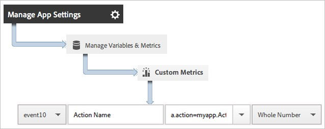

# Analytics

[Analytics](analytics.md#analytics)

[Track App States in Android](analytics.md#track-app-states-in-android)

[Track App Actions in Android](analytics.md#track-app-actions-in-android)

[Track States and Actions in Android](analytics.md#track-states-and-actions-in-android)

[Track App Crashes in Android](analytics.md#track-app-crashes-in-android)

[Hit Batching in Android](analytics.md#hit-batching-in-android)

[Products Variable](analytics.md#products-variable)

[Products Variable with Merchandising eVars and Product-Specific Events 10](analytics.md#products-variable-with-merchandising-evars-and-product-specific-events)

[Event Serialization](analytics.md#event-serialization)

[Video Analytics ](analytics.md#video-analytics)

[Analytics Methods in Android](analytics.md#analytics-methods-in-android)

[Track App States in iOS](analytics.md#track-app-states-in-ios)

[Track App Actions in iOS](analytics.md#track-app-actions-in-ios)

[Track States and Actions in iOS ](analytics.md#track-states-and-actions-in-ios)

[Track App Crashes in iOS ](analytics.md#track-app-crashes-in-ios)

[Hit Batching in iOS](analytics.md#_Toc513631201)

[Products Variable](analytics.md#products-variable-1)

[Products Variable with Merchandising eVars and Product-Specific Events ](analytics.md#products-variable-with-merchandising-evars-and-product-specific-events-1)

[Event Serialization](analytics.md#event-serialization-1)

[Video Analytics](analytics.md#video-analytics-1)

[Analytics Methods in iOS](analytics.md#analytics-methods-in-ios)

## Analytics

This section helps app developers understand how the Mobile Services SDKs interact with Adobe Analytics.

## Track App States in Android

States are the different screens or views in your application. Eachtime a new state is displayed in your application, for example, when a user navigates from the home page to the news feed, a track\(\) call is sent.

> **Important**: You can track the state or track the action, and you can also track the state and action at the same time.

1. Add the library to your project.
2. Import the library:

   ```java
   import com.adobe.marketing.mobile.*;
   ```

3. After creating the the AalyticsRequest instance, call track method to send a hit for this state view:

   ```java
   AdobeMobileMarketing.AnalyticsRequest analyticsRequest = new AdobeMobileMarketing.AnalyticsRequest.Builder(null, "homePage").build();    
   analyticsRequest.track();
   ```

4. Send additional

   In addition to the state name, you can send additional context data with each track call:

   ```java
   Map<String, String> additionalContextData = new HashMap<String, String>();
   additionalContextData.put("customKey", "value"); 
   AdobeMobileMarketing.AnalyticsRequest analyticsRequest = new AdobeMobileMarketing.AnalyticsRequest.Builder(null, "homePage").withContextData(additionalContextData).build(); 
   analyticsRequest.track();
   ```

&gt;

> **\(The following information will chnge depending on what happens with the Launch merge.\)**
>
> Context data values must be mapped to custom variables in [_Adobe Mobile services_](https://mobilemarketing.adobe.com/):


### App State Reporting

> Jiabin: Not sure if we should put so much detail here, maybe there should be a separate page describing how ot view the report, and here we can simply provide a link.

States are typically viewed by using a pathing report, which allows you to see how users navigate your app and which states are most frequently viewed.

| Product | Description |
| --- | --- |
| Adobe Mobile Services | The **View States** report.    This report is based on the paths that the users took through your  application. A sample path is    **Home** &gt;  **Settings** &gt; **Feed**. |
| Adobe Analytics | States can be viewed anywhere that **Pages** can be viewed, such as the **Pages** report, the **Page Views** report, and the   **Path** report. |
| Ad hoc analytics | States can be viewed anywhere  **Pages** can be viewed by using  the **Page** dimension, **Page    Views** metric, **Path** reports. |

## Track App Actions in Android

Actions are the events that occur in your Android app that you want tomeasure. The actions are events that occur in your application that you want to measure; the corresponding metrics will be incremented each time the event occurs. For example, you might want to track when a user clicks the **Log in** button, or when an article was viewed.

> **Important**: In the 5.x SDKs, state and action use the same method. You can track the state or track the action separately or track the state and action at the same time.

1. Add the library to your project.
2. Import the library:

   ```text
   import com.adobe.marketing.mobile.AdobeMobileMarketing;
   ```

3. When the action that you want to track occurs in your app, call track to send a hit for this action:

   ```text
   AdobeMobileMarketing.AnalyticsRequest analyticsRequest = new AdobeMobileMarketing.AnalyticsRequest.Builder("loginClicked", null).build(); 
   analyticsRequest.track();
   ```

   > **\(The following information will change depending on what happens with the Launch merge, so please ignore for now.\)**

4. In the Adobe Mobile Services UI, select your app and click **Manage App Settings**.
5. Click **Manage Variables and Metrics** and click the **Custom Metrics** tab.
6. Map the context data name that is defined in your code, for example, myapp.ActionName, to a custom event.  You can also set a prop to hold all action values by mapping a customprop with a name like **Custom Actions** and setting the value to a.action. 
7. Send additional data

In addition to the action name, you can send additional context data with each track action call:

```text
Map<String, String> additionalContextData = new HashMap<String, String>();
additionalContextData.put("customKey", "value");
AdobeMobileMarketing.AnalyticsRequest analyticsRequest = new AdobeMobileMarketing.AnalyticsRequest.Builder("loginClicked", null).withContextData(additionalContextData).build();
analyticsRequest.track();
```

Context data values must be mapped to custom variables in [_Adobe Mobile services_](https://mobilemarketing.adobe.com/): 

### Action Reporting

| **Interface** | **Report** |
| --- | --- |
| Adobe Mobile Services | **Action Paths** report.       View the order in which actions   occur in your app. You can also    click **Customize** on any report  to view actions ranked, trended,  or in a breakdown report or apply  a filter to view actions for a  specific segment. |
| Marketing reports & analytics | **Custom Event** report.       After an action is mapped to a  custom event, you can view mobile  events similar to all other  Analytics events. |
| Ad hoc analytics | **Custom Event** report.           After an action is mapped to a  custom event, you can view mobile events similar to all other  Analytics events. |

## Track States and Actions in Android

To track states and actions at the same time, type the following:

```text
Map<String, String> additionalContextData = new HashMap<String,
String>();

additionalContextData.put("customKey", "value");

AdobeMobileMarketing.AnalyticsRequest analyticsRequest = new
AdobeMobileMarketing.AnalyticsRequest.Builder("loginClicked",
"mainPage").withContextData(additionalContextData).build();

analyticsRequest.track();
```

> **Important:** please note that tracking an action and a state in the same time will not increment the page views for the given state name. If you want to increment the page views number, you should track only the state name, setting the action name on null.

## Track App Crashes in Android

> This information helps you understand how crashes are tracked and the best practices to handle false crashes. \(Link to Lifecycle content\)
>
>  **\*Prerequisite:** App crashes are tracked as part of lifecycle metrics. Before you can track crashes, add the library to your project. For more information about implementing lifecycle, see \.\*

When lifecycle metrics are implemented, a call is made to

AdobeMobileMarketing.lifecycleStart\(additionalContextData\); in the OnResume\(\) method of each activity. In the onPause\(\) method, a call is made to AdobeMobileMarketing.lifecyclePause\(\); . In the AdobeMobileMarketing.lifecyclePause\(\) method, a flag is set to indicate a graceful exit. When the app is launched again or resumed, AdobeMobileMarketing.lifecycleStart\(additionalContextData\) checks this flag. If the app did not exit successfully as determined by the flag status, an a.CrashEvent context data is sent with the next call and a crash event is reported.

> **Important**: To ensure accurate crash reporting, you must call lifecyclePause\(\) in the onPause\(\) method of each activity.
>
> To understand why this is essential, here is an illustration of the Android activity lifecycle:
>
> 
>
> For more information about the Android activity lifecycle, see [_Activities_](http://developer.android.com/guide/components/activities.html).
>
> _This Android lifecycle illustration was created and_ [_shared by the Android Open Source Project_](http://code.google.com/policies.html) _and used according to terms in the_ [_Creative Commons 2.5 Attribution License_](http://creativecommons.org/licenses/by/2.5/)_._

### What can cause a false crash to be reported?

1. If you are debugging by using an IDE, such as Android Studio, and

   launching the app again from the IDE while the app is in the

   foreground causes a crash.

> **\*Tip:** You can avoid this crash by backgrounding the app before launching again from the IDE.\*

1. If the previous foreground Activity of your app is moved to the

   background and does not call AdobeMobileMarketing.lifecyclePause\(\)

   in onPause\(\), and your app is manually closed or killed by the

   operating system, the next launch results in a crash.

### Emilia -- I think all this section should be moved to lifecycle section, we can add a link to that in the analytics section.

### How should Fragments be handled?

> Fragments have application lifecycle events that are similar to Activities. However, a Fragment cannot be active without being attached to an Activity.
>
>  **\*Important:** You need to rely on the lifecycle events against which the containing activities can run your code. This will be handled by the parent view of the Fragment.\*

### \(Optional\) Implement Activity lifecycle callbacks \(As per Sudeep, TBD for now; "setContext\(\)" might change. Jiabin/Emilia, can you please confirm? Also, can you please provide the correct sample?\)

### Emilia: I think the changes are already in, the new method is called setApplication, I added it in the sample code. \@Jiabin, is there anything else that needs to be changed here?

> Starting with API Level 14, Android allows global lifecycle callbacks for activities. For more information, see the _\[Android\]\(_[http://developer.android.com/reference/android/app/Application.html\#registerActivityLifecycleCallbacks\(android.app.Application.ActivityLifecycleCallbacks](http://developer.android.com/reference/android/app/Application.html#registerActivityLifecycleCallbacks%28android.app.Application.ActivityLifecycleCallbacks)_\) \[Developers Guide\]\(_[http://developer.android.com/reference/android/app/Application.html\#registerActivityLifecycleCallbacks\(android.app.Application.ActivityLifecycleCallbacks](http://developer.android.com/reference/android/app/Application.html#registerActivityLifecycleCallbacks%28android.app.Application.ActivityLifecycleCallbacks)_\)_.
>
> You can use these callbacks to ensure that all of your Activities correctly call AdobeMobileMarketing.collectLaunchInfo\(Activity activity\); and AdobeMobileMarketing .lifecyclePause\(\). You need to add this code only in your main Activity and any other Activity in which your app may be launched
>
> To send additional context data with your lifecycle call, use **will move to Lifecycle section**
>
> Config.collectLifecycleData\(Activity activity, Map\ contextData\). You must override the onResume method for that Activity and ensure that you call super.onResume\(\) after manually calling collectLifecycleData.

## Hit Batching in Android

Hit batching allows applications to hold hits from being sent until the number of hits in the queue have exceeded the configured limit.To use hit batching, you must enable offline tracking.

### Requires SDK version 5.0 or later

To enable hit batching, update your configuration and specify a value for batchLimit:

```text
{
"analytics.batchLimit": 5,
\...
}
```

When the value is greater than 0, the SDK queues the number of hits equal to the _analytics.batchLimit_ value. After this threshold is passed, all hits in the queue are sent.

The following methods are used with hit batching:

* AdobeMobileMarketing.getQueueSize returns the total number of hits currently in the queue in a callback.
* AdobeMobileMarketing.sendQueuedHits forces the library to send all hits in the queue no matter how many hits are currently queued.
* AdobeMobileMarketing.clearQueue clears all hits from the queue without sending them.

## Products Variable

> **\(Is this section still necessary in v5? Sudeep says "yes".\)** **yes**

The _products_ variable cannot be set by using processing rules. In the Mobile SDK, you must use a special syntax in the context data parameter to set _products_ on the server call. To set the _products_ variable, set a context data key to "&&products", and set the value by using the syntax that is definedfor the _products_ variable:

```text
cdata.put(\"&&products\", \"Category;Product;Quantity;Price\[,Category;Product;Quantity;Price\]\");
```

For example:

```text
//create a context data map
Map<String, String> cdata = new HashMap<String, String>();

// add products, a purchase id, a purchase context data key, and any other data you want to collect.
// Note the special syntax for products
cdata.put("&&products", ";Running Shoes;1;69.95,;Running Socks;10;29.99"); cdata.put("myapp.purchase", "1");
cdata.put("myapp.purchaseid", "1234567890");

// build the analytics request and send the tracking call
AdobeMobileMarketing.AnalyticsRequest analyticsRequest = new AdobeMobileMarketing.AnalyticsRequest.Builder
        ("actionName", "stateName").withContextData(cdata).build();
analyticsRequest.track();
```

The _products_ variable is set on the image request, and the othervariables are set as context data:


All context data variables must be mapped by using processing rules:


> You do not need to map the _products_ variable by using processing rules because this variable is set directly on the image request by the SDK.

## Products Variable with Merchandising eVars and Product-Specific Events

> **\(Is this section still necessary in v5? Sudeep says "yes".\)** **- Emilia - yes, this remains the same in v5**

Here is an example of the _products_ variable with Merchandising eVars and product-specific events.

```text
// create a context data map
Map<String, String> cdata = new HashMap<String, String>();

// add products, a purchase id, a purchase context data key, and any other data you want to collect.
// Note the special syntax for products cdata.put("&&events", "event1");
cdata.put("&&products", ";Running Shoes;1;69.95;event1=5.5;eVar1=Merchandising,;Running Socks;10;29.99");
cdata.put("myapp.purchase", "1");
cdata.put("myapp.purchaseid", "1234567890");

// send the tracking call
AdobeMobileMarketing.AnalyticsRequest analyticsRequest = new AdobeMobileMarketing.AnalyticsRequest.Builder("actionName", "stateName").withContextData(cdata).build();
analyticsRequest.track();
```


> **\*Tip:** If you trigger a product-specific event by using the &&products variable, you must also set that event in the &&events variable. If you do not set that event, it is filtered out during processing.\*

## Event Serialization

> **\(Is this section still necessary in v5? Sudeep says "yes".\) Emilia - yes**

Event serialization is not supported by processing rules. In the Mobile SDK, you must use a special syntax in the context data parameter to set serialized events directly on the server call.

```text
 cdata.put(\"&&events\", \"event1:12341234\");
```

For example:

```text
//create a context data map
Map<String, String> cdata = new HashMap<String, String>();

// add events
cdata.put("&&events", "event1:12341234");

// create the analytics request and send the tracking call
AdobeMobileMarketing.AnalyticsRequest analyticsRequest = new AdobeMobileMarketing.AnalyticsRequest.Builder("actionName", "stateName").withContextData(cdata).build();
analyticsRequest.track();
```

## Video Analytics

> **Via Slack, Himanshu said "v5 does not have milestone tracking; they should just follow VHL documentation and use VHL SDK instead for video tracking."**
>
> **Emilia: we should document the way you install the VHL SDK extension from Launch UI.**

## Analytics Methods in Android

> Here is a list of Adobe Analytics methods that are provided by the Android library:

Since we will also provide public API docs, is it easier to just provide a link here?

| **Method** | **Description** |
| --- | --- |
| analyticsClearQueue | Link to API docs |
| analyticsGetTrackingIdentifier | Link to API docs |
| analyticsRequest.track | Link to API docs |
| analyticsSendQueuedHits | Link to API docs |
| analyticsGetQueueSize | Link to API docs |

## Track App States in iOS

States are the different screens or views in your application. Each time a new state is displayed in your application, for example, when a user navigates from the home page to the news feed, a track state call should be sent. In iOS, a state is typically tracked in the viewDidLoad method of each view.


> **\*Tip:** To track states, make a call to trackState. States are not automatically tracked.\*

1. Add the library to your project and implement lifecycle.
2. Import the library.

   ```text
    #import "ADBMobileMarketing.h"
   ```

3. Call `[ADBMobileMarketing analyticsTrack:]` to send a hit for the state view.

   ```text
   ADBAnalyticsRequest *request = [[ADBAnalyticsRequest alloc] init];
   request.state = @"test state";

   [ADBMobileMarketing analyticsTrack:request];
   ```

In Adobe Mobile services, the state name is reported in the _View State_ variable, and a view is recorded for each track\_state\_request.state call. In other Analytics interfaces, **View State** is reported as **Page Name**, and state views is reported as page views.

1. In addition to the state name, you can send additional context data with each track state call:

   ```text
   ADBAnalyticsRequest *request = [[ADBAnalyticsRequest alloc] init];
   request.state = @"test state";
   request.contextData = @{@"key":@"value"};
   ```

Context data values must be mapped to custom variables in the Mobile Services UI:


### App State Reporting

> Jiabin: Not sure if we should put so much detail here, maybe there should be a separate page describing how ot view the report, and here we can simply provide a link.

States are typically viewed by using a pathing report, which allows you to see how users navigate your app and which states are most frequently viewed.

| Product | Description |
| --- | --- |
| Adobe Mobile Services | The **View States** report.    This report is based on the paths that the users took through your  application. A sample path is    **Home** &gt;  **Settings** &gt; **Feed**. |
| Adobe Analytics | States can be viewed anywhere that **Pages** can be viewed, such as the **Pages** report, the **Page Views** report, and the   **Path** report. |
| Ad hoc analytics | States can be viewed anywhere  **Pages** can be viewed by using  the **Page** dimension, **Page    Views** metric, **Path** reports. |

## Track App Actions in iOS

Actions are the events that occur in your app that you want to measure. Each action has one or more corresponding metrics that are incremented each time the event occurs. For example, you might track a new subscription, each time an article is viewed or each time a level is completed. The corresponding metrics for these events are configured as subscriptions, articles read, and levels completed.

Actions are not tracked automatically, so to track an event, you must call create a ADBAnalyticsRequest instance with an action name.

1. Add the library to your project.
2. Import the library.

   ```text
   #import "ADBMobileMarketing.h"
   ```

3. When the action that you want to track occurs in your app, call track\_action\_request to send a hit for this action.

   ```text
   ADBAnalyticsRequest *request = [[ADBAnalyticsRequest alloc] init];
   request.action = @"test action";
   [ADBMobileMarketing analyticsTrack:request];
   ```

    **Tip:** If the code where you areadding this call might run while the app is in the background, call **trackActionFromBackground** instead of **track\_action\_request**.

4. In Adobe Mobile services, select your app and click **Manage App Settings**.
5. Click **Manage Variables and Metrics** and click the **Custom Metrics** tab.
6. Map the context data name that is defined in your code \(for example, **a.action=myapp.ActionName** to a custom event.

> **\(The following screenshot depends on the merge with Launch.\)**

```text


> You can also set a prop to hold all action values by mapping a custom
> prop with a name like **Custom Actions** and setting the value to
> a.action.
>
> **(The following screenshot depends on the merge with Launch.)**


```

1. Send additional data.

In addition to the action name, you can send additional context data with each track action call: Context data values must be mapped to custom variables in Adobe Mobile services:

```text
    ADBAnalyticsRequest *request = [[ADBAnalyticsRequest alloc] init];
    request.action = @"test action";
    request.contextData = @{@"key":@"value"};
    ADBMobileMarketing analyticsTrack:request];
```

**\(The following screenshot depends on the merge with Launch.\)**


## Track States and Actions in iOS

Here is an example of tracking states and actions at the same time,:

```text
ADBAnalyticsRequest *request = [[ADBAnalyticsRequest alloc] init];
request.action = @"test action";
request.state = @"test state";
[ADBMobileMarketing analyticsTrack:request];
```

## Track App Crashes in iOS

> This information helps you understand how crashes are tracked and the best practices to handle false crashes.
>
>  **\*Important:** You should upgrade to iOS SDK version 4.8.6, which contains critical changes that prevent false crashes from being reported.\*

### When does Adobe report a crash?

> If your application is terminated without having first been backgrounded, the SDK reports a crash the next time your app is launched.

### How does crash reporting work?

Everything in this segment has changed in v5, if we decide to provide those info in Analytics module instead of Lifecyle, then I can draft up something.

> iOS uses system notifications that allow developers to track and respond to different states and events in the application lifecycle. The Adobe Mobile iOS SDK has a notification handler that responds to the
>
> UIApplicationDidEnterBackgroundNotification notification. In this code, a value is set that indicates that the user has backgrounded the app. On a subsequent launch, if that value cannot be found, a crash is reported.

### Why does Adobe measure crashes this way?

> This approach of measuring crashes provides a high-level answer to the question, _Did the user exit my app intentionally?_
>
> Crash reporting libraries provided by companies like Apteligent \(formerly Crittercism\) use a global NSException handler to provide more detailed crash reporting. Your app is not allowed to have more than one of these kinds of handlers. Adobe decided to not implement a global NSException handler to prevent build errors, knowing that our customers might be using other crash reporting providers.

### What can cause a false crash to be reported?

Most of the things in this segment have changed in v5 as well

> The following scenarios are known to falsely cause a crash to be reported by the SDK:

* If you are debugging using Xcode, launching the app again while it

  is in the foreground, causes a crash.

> **\*Tip:** You can avoid a crash in this scenario by backgrounding the app before launching the app again from Xcode.\*

* If your app is in the background and sends Analytics hits through a

  call other than **trackActionFromBackground**, **trackLocation**, or

  **trackBeacon**, and the app is terminated \(manually or by the OS\)

  while in the background, and the next launch will be a crash.

>  **\*Tip:** Background activity that occurs beyond the lifecycleTimeout threshold might also result in an additional false launch.\*

* If your app is launched in the background because of a background fetch, location update, and so on, and is terminated by the OS without coming to the foreground, the next launch \(background or foreground\) results in a crash.
* If you programmatically delete Adobe's pause flag from NSUserDefaults, while the app is in the background, the next launch or resume causes a crash.

### How can I prevent false crashes from being reported?

> The following practices can help you prevent false crashes from being reported:

* In iOS SDK 4.8.6, code was added to better determine whether a new lifecycle session is actually wanted. This code fixes false crashes \#2 and \#3 in the previous section.
* Ensure that you perform your development against non-production report suites, which should prevent false crash \#1 from

> occurring.

* Do not delete or modify any values that the Adobe Mobile SDK puts in

  NSUserDefaults. If these values are modified outside the SDK, the

  data reported will be invalid.

## Hit Batching in iOS

Hit batching allows applications to hold hits from being sent until the number of hits in the queue have exceeded the configured limit.To use hit batching, you must enable offline tracking.

### Requires SDK version 5.0 or later

To enable hit batching, update your config file and specify a value for analytics.batchLimit:

```text
 {
 "analytics.batchLimit": 5,
...
 }
```

When the value is greater than 0, the SDK queues the number of hits equal to the _analytics.batchLimit_ value. After this threshold is passed, all hits in the queue are sent.

The following methods are used with hit batching:

* ADBMobileMarketing.analyticsGetQueueSize: callback - returns a long with the number of hits currently in the hit batching queue.
* ADBMMobileMarketing.analyticsSendQueuedHits - forces the library to send all hits in the queue no matter how many hits are currently queued.
* AdobeMobileMarketing.analyticsClearQueue - clears all hits from the queue without sending them.

## Products Variable

The _products_ variable cannot be set by using processing rules. In the iOS 4.x SDK, you must use a special syntax in the context data parameter to set _products_ directly on the server call.

To set the _products_ variable, set a context data key to "&&products", and set the value by using the syntax that is defined for the variable:

For example:

```text
ADBAnalyticsRequest *request = [[ADBAnalyticsRequest alloc] init];
request.action = @"test action";
request.state = @"test state";
request.contextData = @{@"&&products":@"Running Shoes;1;69.95,;Running Socks;10;29.99",
                        @"myapp.purchase":@"1",
                        @"myapp.purchaseid":@"1234567890"
                        };
[ADBMobileMarketing analyticsTrack:request];
```

_products_ is set directly on the image request, and the other variables are set as context data:


All context data variables must be mapped by using processing rules:


You do not need to map the _products_ variable using processing rules because it is set directly on the image request by the SDK.

## Products Variable with Merchandising eVars and Product-Specific Events

Here is an example of the _products_ variable with Merchandising eVars and product-specific events.

```text
ADBAnalyticsRequest *request = [[ADBAnalyticsRequest alloc] init];
request.action = @"test action";
request.state = @"test state";
request.contextData = @{@"&&products":@"";Running Shoes;1;69.95;event1=5.5;eVar1=Merchandising,;Running Socks;10;29.99",
                        @"myapp.purchase":@"1",
                        @"myapp.purchaseid":@"1234567890"
                        };
[ADBMobileMarketing analyticsTrack:request];
```

**\*Tip:** If you trigger a product-specific event by using the &&products variable, you must also set that event in the &&events variable. If you do not set that event, it is filtered out during processing.\*

## Event Serialization

Event serialization is not supported by processing rules. In the Mobile SDK, you must use a special syntax in the context data parameter to set serialized events directly on the server call.

For example:

```text
ADBAnalyticsRequest *request = [[ADBAnalyticsRequest alloc] init];
request.action = @"test action";
request.state = @"test state";    
request.contextData = @{@"&&events":@"event1:12341234"};
[ADBMobileMarketing analyticsTrack:request];
```

## Video Analytics

> **Via Slack, Himanshu said "v5 doesn't have video tracking; they should just follow VHL documentation and use VHL SDK instead for video tracking. As a result, I've deleted all of the Video Analytics content.**

## Analytics Methods in iOS

Here is a list of Adobe Analytics methods that are provided by the iOS library:

| **Method** | **Description** |
| --- | --- |
| `[ADBMobileMarketing   analyticsTrack]` | Link to API docs |
| `[ADBMobileMarketing   analyticsGetTrackingIdentifier:]` | Link to API docs |
| `[ADBMobileMarketing   analyticsGetQueueSize:]` | Link to API docs |
| `[ADBMobileMarketing   analyticsClearQueue]` | Link to API docs |
| `[ADBMobileMarketing   analyticsSendQueuedHits]` | Link to API docs |

